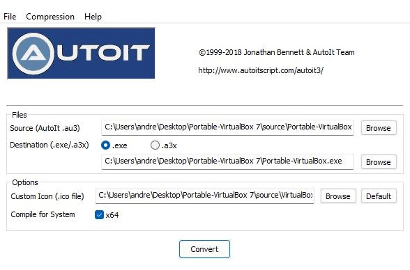

# About VirtualBox
[ORACLE VirtualBox](https://www.virtualbox.org/) is cross-platform virtualization software that allows users to run guest operating systems inside a host operating system without having to reboot. 

Please refer to the  [user manual](https://www.virtualbox.org/manual/ch01.html)  for thoroughly information.

# About Portable-VirtualBox
Portable-VirtualBox is a free and open source software tool that lets you run [VirtualBox](https://www.virtualbox.org/) from a USB stick (almost1) without separate installation. Services are started along with the tool and are removed after stopping all machines and closing the tool itself.

Initially the tool was developed and maintained by Runar Buvik. Check out his site at http://www.vbox.me/. 

This fork has been evolved in order to restore compatibility with newer versions of VirtualBox and has been tested with VirtualBox 7.0.8.

# Motivation
Sometimes it can be quite handy to run VirtualBox as a portable application, because you can bundle everything together in one folder. 

In addition, switching from Hyper-V to VirtualBox and vice versa is less problematic, if using a portable installation. As mentioned in this [Stackoverflow post](https://stackoverflow.com/questions/30496116/how-to-disable-hyper-v-in-command-line) Use the following commands to de-/activate Hyper-V:

- `C:\Windows\System32\bcdedit.exe /set hypervisorlaunchtype off` and 
- `C:\Windows\System32\bcdedit.exe /set hypervisorlaunchtype auto`

A reboot afterwards is required. This may also be of interest, if [Docker for Windows](https://docs.docker.com/desktop/install/windows-install/) is used.

# Building

First get a copy of [AutoIt](https://www.autoitscript.com/site/) from the download section and install or extract the package. Afterwards clone this project and convert `Portable-VirtualBox.au3` with `Aut2exe_x64.exe` or `Aut2exe.exe`. 

&nbsp;&nbsp;&nbsp;&nbsp;&nbsp;

# Running

Running VirtualBox requires the [Microsofdt C++ Redistributable1](https://learn.microsoft.com/de-DE/cpp/windows/latest-supported-vc-redist?view=msvc-170) package. If not installed an [error](https://github.com/trinimon/portable-virtualbox/blob/master/images/dll.jpg) is thrown. On first start of Portable-VirtualBox the tool asks for the preferred language and package extraction parameters:

&nbsp;&nbsp;&nbsp;&nbsp;&nbsp;

On second start the tool sets up folders and settings for subsequent runs. Restart VirtualBox and Portable-VirtualBox to use this setup from now on.
